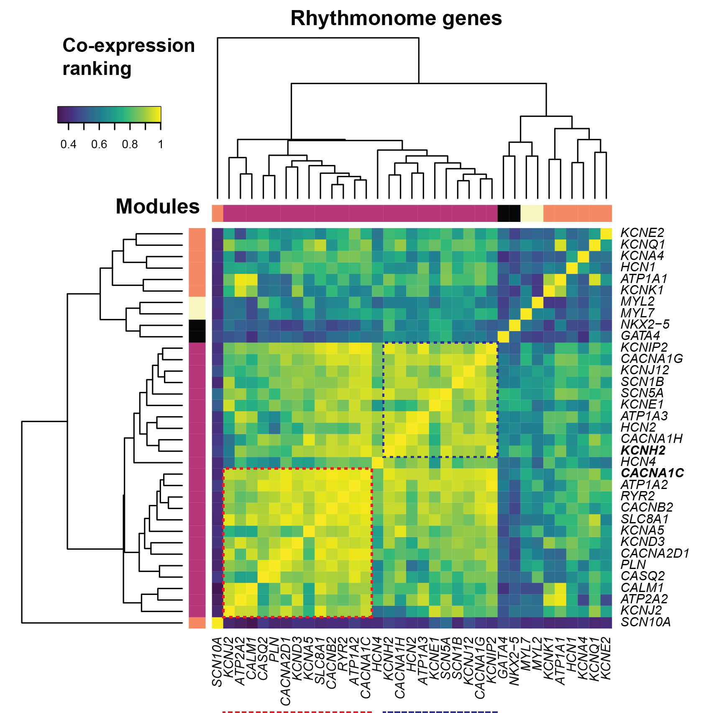

# hERG-cal co-expression analysis
Cardiac electrical activity is controlled by the carefully orchestrated activity of more than a dozen different ion conductances. Yet, there is considerable variability in cardiac ion channel expression levels both within and between subjects. We tested the hypothesis that variations in ion channel expression between individuals are not random but rather there are modules of co-expressed genes and that these modules make electrical signaling in the heart more robust.

